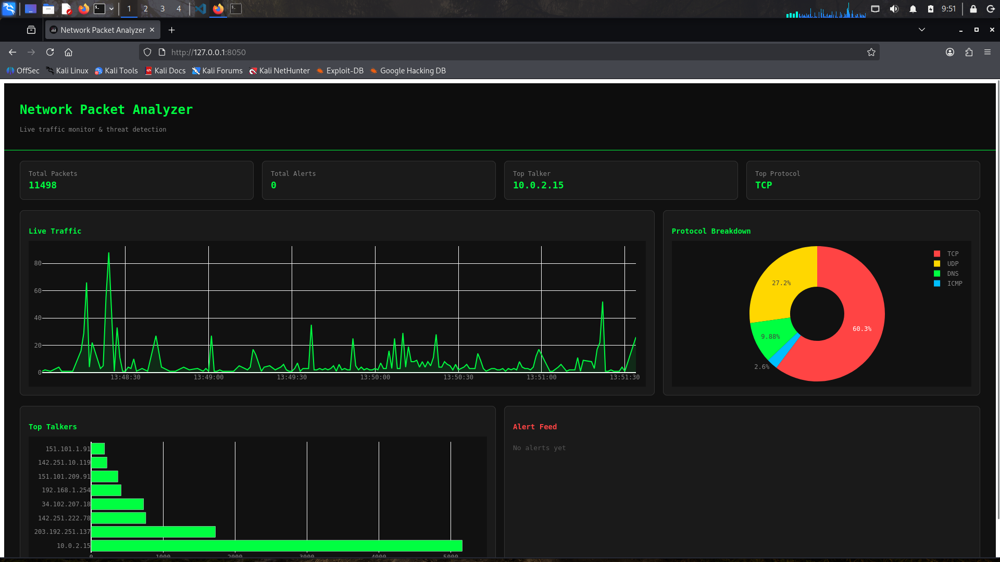

# 🔍 Network Packet Analyzer


A real-time network packet analyzer built entirely in Python on Kali Linux.
Captures live network traffic, decodes multiple protocols, detects active threats
using sliding-window algorithms, and visualizes everything on a cyberpunk-styled
live web dashboard — updating every 2 seconds.

> Built as a hands-on cybersecurity portfolio project to demonstrate skills in
> network security, Python programming, threat detection, and data visualization.

---

## 📸 Dashboard Preview




**The live dashboard shows:**
- **Live traffic graph** — packets per second updating every 2 seconds
- **Protocol breakdown** — TCP vs UDP vs DNS distribution
- **Top talkers** — most active source IPs on the network
- **Alert feed** — real-time threat detection alerts with severity levels
- **Stat cards** — total packets, alerts, top talker IP, dominant protocol

---

## ✨ Features

### Packet Capture
- Live capture on any network interface (`eth0`, `wlan0`, `lo`)
- BPF (Berkeley Packet Filter) support for targeted capture
- Handles high-volume traffic without dropping packets (non-blocking)
- Automatically identifies and labels each packet's protocol

### Protocol Parsing
| Protocol | What is Parsed |
|----------|---------------|
| **TCP** | Source/dest ports, connection flags (SYN, ACK, FIN, RST, PSH) |
| **UDP** | Source/dest ports, payload size |
| **DNS** | Domain queries, response IPs, both A and AAAA records |
| **HTTP** | Method (GET/POST), Host header, URL path (port 80 traffic) |
| **ARP** | IP-to-MAC mappings, detects MAC changes (spoofing) |
| **ICMP** | Echo request/reply (ping traffic) |

### Threat Detection
| Threat | Detection Method | Severity |
|--------|-----------------|----------|
| **Port Scan** | Sliding window — >20 SYN packets from same IP in 10s | HIGH |
| **Brute Force** | >10 connection attempts to SSH/FTP/RDP in 60s | HIGH |
| **DNS Tunneling** | Domain query name longer than 50 characters | MEDIUM |
| **ARP Spoofing** | Same IP maps to a different MAC than previously seen | HIGH |

### Dashboard (Real-Time)
- Live traffic line chart — packets/second over a 60-second rolling window
- Protocol distribution pie chart
- Top 10 talkers bar chart (most active source IPs)
- Color-coded alert feed (HIGH = red, MEDIUM = amber)
- 4 stat cards — total packets, total alerts, top talker IP, top protocol
- Auto-refreshes every 2 seconds using Dash Interval component

### Data Storage
- All packets and alerts saved to SQLite database
- Indexed on timestamp for fast time-range queries
- Thread-safe writes using Python threading locks
- Queryable for offline analysis in Jupyter/Excel

---

## 🏗️ Architecture


**Data flow:**
1. `sniffer.py` captures raw packets from the network interface
2. Each packet is passed to all parsers to extract readable details
3. Each packet is simultaneously passed to all detectors
4. Packets and alerts are saved to SQLite via `PacketLogger`
5. The Dash dashboard queries SQLite every 2 seconds and updates all charts

---

## 🛠️ Tech Stack

### Core Libraries

#### 🦈 Scapy `2.5.0`
The heart of the project. Scapy is a powerful Python library for packet manipulation
that lets you capture, forge, decode, and send network packets at the raw socket level.

- Used for **live packet capture** via `sniff()` function
- Used for **layer extraction** — `packet[IP]`, `packet[TCP]`, `packet[DNS]` etc.
- Used for **packet crafting** in tests — build fake packets to test detectors
- Operates below the OS network stack — sees every raw byte on the wire
- The `store=False` option prevents RAM buildup during long captures
- `stop_filter` lambda lets the main thread signal the sniffer to stop cleanly

```python
# How Scapy captures packets
sniff(iface="eth0", prn=callback, store=False,
      stop_filter=lambda _: stop_event.is_set())
```

#### 🦈 PyShark `0.6.0`
Python wrapper around tshark (Wireshark's command-line engine). While Scapy does
the heavy lifting in this project, PyShark adds deep packet inspection capability
for more complex protocol decoding. Requires tshark to be installed on the system.

```python
# PyShark can decode 2000+ protocols Scapy doesn't natively support
import pyshark
cap = pyshark.LiveCapture(interface='eth0')
```

#### 📊 Dash `4.3.0`
Python framework for building web analytics applications. Built on top of Flask
(web server), React (frontend), and Plotly (charts). No JavaScript required.

- `dash.Dash()` creates the web application instance
- `html.Div()`, `html.H1()` etc. are Python representations of HTML elements
- `dcc.Graph()` renders Plotly charts
- `dcc.Interval()` fires a callback every N milliseconds — used for live updates
- `@app.callback()` decorator connects inputs to outputs reactively
- `app.run()` starts the Flask development server

```python
# How Dash live updates work
@app.callback(Output("traffic-graph", "figure"),
              Input("tick", "n_intervals"))
def update(_):
    data = query_database()
    return build_chart(data)
```

#### 📈 Plotly `6.8.0`
Interactive graphing library used by Dash to render charts.

- `go.Scatter()` — line chart for traffic over time
- `go.Pie()` — protocol distribution donut chart
- `go.Bar()` — horizontal bar chart for top talkers
- `fig.update_layout()` — controls colors, background, fonts, margins
- All charts are interactive — hover, zoom, pan work out of the box

#### 🐼 Pandas `3.0.3`
Data analysis library used for handling packet data efficiently.
Particularly useful for time-series aggregation and CSV export.

#### 🗄️ SQLite3 (built into Python)
Lightweight, serverless, file-based SQL database. No installation needed.
The entire database is a single file (`packets.db`) in the project folder.

- Two tables: `packets` and `alerts`
- Indexed on timestamp for fast dashboard queries
- `threading.Lock()` prevents race conditions between the sniffer thread
  (writing) and the dashboard thread (reading) accessing the DB simultaneously

#### 🎨 Colorama `0.4.6`
Cross-platform colored terminal output. Used to color-code alert messages
printed to the terminal (RED for HIGH severity, YELLOW for MEDIUM).

---

## 📁 Project Structure

```
network-packet-analyzer/
│
├── main.py                  # Entry point — parses CLI args, starts threads
├── verify_setup.py          # Checks all dependencies and structure are correct
├── requirements.txt         # All Python package dependencies with versions
├── README.md                # This file
├── packets.db               # SQLite database (auto-created on first run)
├── .gitignore
│
├── capture/
│   ├── __init__.py          # Makes folder a Python package
│   └── sniffer.py           # Core packet capture engine using Scapy sniff()
│                            # Runs in a daemon thread started by main.py
│                            # Passes every packet to parsers + detectors
│
├── parsers/
│   ├── __init__.py
│   ├── tcp_parser.py        # Extracts TCP src/dst ports and flag names
│   ├── dns_parser.py        # Decodes DNS queries and response IP addresses
│   ├── http_parser.py       # Extracts HTTP method, host, path from raw payload
│   └── arp_parser.py        # Parses ARP requests/replies, maintains IP→MAC table
│                            # Detects ARP spoofing when MAC changes for known IP
│
├── detectors/
│   ├── __init__.py
│   ├── port_scan.py         # Sliding window SYN counter per source IP
│   │                        # Alert: >20 SYNs from same IP in 10 seconds
│   ├── brute_force.py       # Tracks connection attempts to auth ports (22,21,3389)
│   │                        # Alert: >10 attempts to same port in 60 seconds
│   └── dns_tunnel.py        # Checks DNS query name length
│                            # Alert: domain name > 50 characters
│
├── db/
│   ├── __init__.py
│   └── logger.py            # PacketLogger class — all SQLite operations
│                            # log_packet(), log_alert(), get_recent_packets()
│                            # get_protocol_counts(), get_top_talkers()
│                            # get_traffic_timeseries(), get_recent_alerts()
│                            # Thread-safe via threading.Lock()
│
├── dashboard/
│   ├── __init__.py
│   ├── app.py               # Creates and configures the Dash app instance
│   ├── layouts.py           # Defines all HTML/component structure of the UI
│   │                        # stat_card(), create_layout(), card_style()
│   └── callbacks.py         # All @app.callback functions for live updates
│                            # update_traffic(), update_proto(), update_talkers()
│                            # update_alerts(), update_stats()
│
└── tests/
    ├── test_parsers.py      # Unit tests using crafted Scapy packets
    └── test_detectors.py    # Unit tests for threat detection thresholds
```

---

## ⚙️ Setup & Installation

### System Requirements
- **OS**: Kali Linux (recommended) or any Debian/Ubuntu-based Linux
- **Python**: 3.10 or higher
- **RAM**: 4GB minimum (8GB recommended if running in VirtualBox)
- **tshark**: Required by PyShark — installed via Wireshark package

### Step 1 — Clone the repository
```bash
git clone https://github.com/darshanhudeda/network-packet-analyzer.git
cd network-packet-analyzer
```

### Step 2 — Install tshark
```bash
sudo apt update
sudo apt install -y tshark wireshark-common

# When prompted: select YES to allow non-superusers to capture
```

### Step 3 — Create virtual environment
```bash
python3 -m venv venv
source venv/bin/activate
# Your prompt should now show (venv)
```

### Step 4 — Install Python dependencies
```bash
pip install -r requirements.txt
```

### Step 5 — Grant capture permissions (avoid sudo on every run)
```bash
sudo usermod -aG wireshark $USER
newgrp wireshark  # apply without logging out
```

### Step 6 — Verify everything is working
```bash
python3 verify_setup.py
# Expected: ALL CHECKS PASSED
```

---

## 🚀 Running the Project

### Basic run (default interface eth0)
```bash
sudo /home/carry/venv/bin/python3 main.py --iface eth0
```

### With a specific interface
```bash
# Find your interface name first
ip link show

# Run on wifi interface
sudo /home/carry/venv/bin/python3 main.py --iface wlan0
```

### With a BPF filter (capture only specific traffic)
```bash
# Only capture HTTP traffic
sudo /home/carry/venv/bin/python3 main.py --iface eth0 --filter "tcp port 80"

# Only capture DNS traffic
sudo /home/carry/venv/bin/python3 main.py --iface eth0 --filter "udp port 53"
```

### Custom dashboard port
```bash
sudo /home/carry/venv/bin/python3 main.py --iface eth0 --port 9090
```

### Open dashboard in browser
```
http://localhost:8050
```

### Stop the analyzer
```
Press Ctrl+C in the terminal
```

---

## 🧪 Testing the Threat Detectors

Open a **second terminal** while the analyzer is running and use these commands
to trigger each detector and see alerts appear live on the dashboard:

### Trigger Port Scan Detection
```bash
# Sends SYN packets to 1000 ports — triggers HIGH alert
sudo nmap -sS 127.0.0.1 -p 1-1000
```
Expected alert: `[HIGH] PORT_SCAN — X SYN packets in 10s`

### Trigger DNS Detection
```bash
# Multiple DNS queries — also tests DNS tunneling detector
dig google.com
dig youtube.com
dig facebook.com
dig github.com
```

### Trigger HTTP Parser
```bash
# Sends HTTP GET request — appears in dashboard as TCP traffic
curl http://example.com
curl http://neverssl.com
```

### Generate ICMP Traffic
```bash
# Ping generates ICMP echo request/reply packets
ping -c 20 8.8.8.8
```

### Check your captured data
```bash
python3 -c "
from db.logger import PacketLogger
l = PacketLogger('packets.db')
print('Total packets:', len(l.get_recent_packets(9999999)))
print('Protocols:', l.get_protocol_counts())
print('Top talkers:', l.get_top_talkers(5))
print('Recent alerts:', l.get_recent_alerts(5))
"
```

---

## 🗄️ Database Schema

```sql
-- Every captured packet is stored here
CREATE TABLE packets (
    id      INTEGER PRIMARY KEY AUTOINCREMENT,
    ts      TEXT,        -- UTC timestamp ISO 8601
    src     TEXT,        -- source IP address
    dst     TEXT,        -- destination IP address
    proto   TEXT,        -- TCP / UDP / DNS / ICMP / ARP / OTHER
    sport   INTEGER,     -- source port (0 for ICMP/ARP)
    dport   INTEGER,     -- destination port (0 for ICMP/ARP)
    size    INTEGER      -- packet size in bytes
);

-- Every threat detection alert is stored here
CREATE TABLE alerts (
    id       INTEGER PRIMARY KEY AUTOINCREMENT,
    ts       TEXT,       -- UTC timestamp ISO 8601
    src      TEXT,       -- source IP that triggered the alert
    type     TEXT,       -- PORT_SCAN / BRUTE_FORCE / DNS_TUNNEL / ARP_SPOOF
    severity TEXT,       -- HIGH / MEDIUM / LOW
    detail   TEXT        -- human-readable description of the alert
);
```

---

## 🧠 Key Concepts Explained

### How Sliding Window Detection Works
Port scan and brute force detection use a **sliding window algorithm**:

```python
# Keep only timestamps within the last N seconds
syn_log[src] = [t for t in syn_log[src] if now - t < WINDOW_SECONDS]
syn_log[src].append(now)

# If count exceeds threshold → alert
if len(syn_log[src]) > THRESHOLD:
    alert(...)
```

This is memory efficient — old entries are automatically discarded.
The same pattern is used in production IDS systems like Snort and Suricata.

### Why Thread Safety Matters
The sniffer runs in a **background daemon thread** while the dashboard
runs in the **main thread**. Both access the SQLite database simultaneously.
Without a lock, writes and reads can collide and corrupt data.

```python
# Every DB operation is wrapped in a lock
with self.lock:
    self.conn.execute("INSERT INTO packets ...")
    self.conn.commit()
```

### How Dash Live Updates Work
Dash uses a **reactive callback** pattern. The `dcc.Interval` component fires
every 2000ms, which triggers all `@app.callback` functions simultaneously.
Each callback queries the database and returns fresh chart data to the browser.

```
dcc.Interval fires every 2s
         │
         ├──► update_traffic() → queries DB → returns line chart
         ├──► update_proto()   → queries DB → returns pie chart
         ├──► update_talkers() → queries DB → returns bar chart
         ├──► update_alerts()  → queries DB → returns alert list
         └──► update_stats()   → queries DB → returns 4 stat numbers
```

---

## 📊 Sample Captured Data

Real data captured during testing (YouTube + ping session):

```
Total packets : 10,291
TCP           : 6,113  (59%) — web browsing, YouTube streams
UDP           : 3,129  (30%) — QUIC protocol (YouTube uses QUIC)
DNS           :   949   (9%) — domain lookups
ICMP          :   100   (1%) — ping traffic

Top Talkers:
  10.0.2.15         4,515 pkts  ← Kali VM (our machine)
  203.192.251.137   1,729 pkts  ← Indian ISP server
  142.251.222.78      760 pkts  ← Google (YouTube)
  34.102.207.18       614 pkts  ← Google services
  192.168.1.254       347 pkts  ← Home router
```

---

## 🔮 Future Improvements

- [ ] GeoIP mapping — plot source IPs on a world map
- [ ] HTTPS / TLS metadata extraction (SNI field)
- [ ] Machine learning anomaly detection using Isolation Forest
- [ ] Email/Slack alerting for HIGH severity threats
- [ ] PCAP file export for Wireshark analysis
- [ ] Dark/light theme toggle on dashboard
- [ ] Authentication on the dashboard (login page)
- [ ] Docker containerization for easy deployment
- [ ] Integration with MISP threat intelligence feeds

---

## 💡 What I Learned

- How network packets are structured across OSI layers (L2 to L7)
- How to use Scapy for raw packet capture and crafting
- How sliding window algorithms detect port scans and brute force attacks
- How Dash and Plotly work together to build real-time web dashboards
- How SQLite handles concurrent reads/writes with Python threading locks
- How DNS tunneling works and why long domain names are suspicious
- How ARP spoofing works at the MAC address level
- How to structure a multi-module Python project cleanly
- How to run long-running background tasks safely using daemon threads
- Why sudo and virtual environments conflict and how to solve it

---

## 👤 Author

**Darshan c Hudeda**
- GitHub: [@darshanhudeda](https://github.com/darshanhudeda)
- Built on Kali Linux running in VirtualBox

---

## 📄 License

MIT License — free to use, modify, and distribute.
